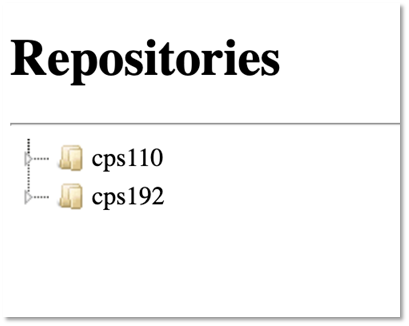
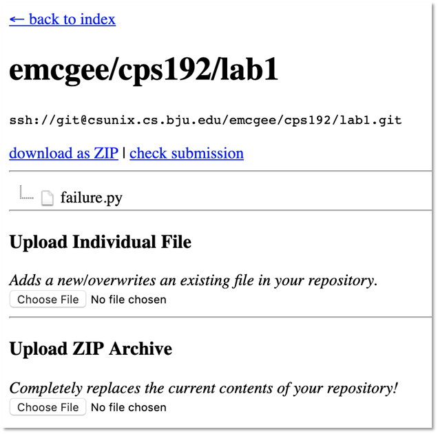
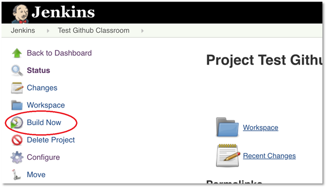
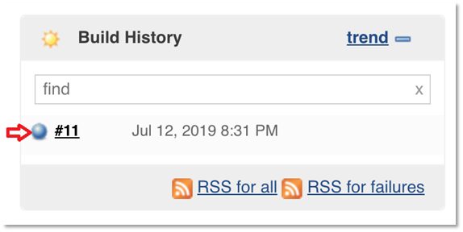

# Submission System Instructions

These instructions describe how to use the Computer Science Submission System ("Submitter") to submit class assignments.

> Note: The images here were produced on an OS X machine, but the same instructions (unless otherwise noted) also apply to Windows / Linux machines.

You can [watch a short video](https://bju.hosted.panopto.com/Panopto/Pages/Viewer.aspx?id=8d5ae2d3-c3e3-4d71-a287-a9520154baaa) that demonstrates how to do all of the below.

## Submitting Assignments

To submit an assignment, go to [Submitter](https://protect.bju.edu/cps/submit/upload).

Use the accordion menu to find the correct class and assignment. Then click the assignment. 

You can upload as many files as you need by using the `Upload Individual File` option, or to upload multiple files, create a [Zip archive](https://www.wikihow.com/Make-a-Zip-File) with all your files in it then use the `Upload ZIP Archive` option.

> Note: Once a file is uploaded, you can delete it by right-clicking the file and selecting `Delete`.

## Testing an Assignment

To test an assignment, click the `Check Submission` link at the top of the page. You will be prompted to login to Jenkins, the assignment checking system. Login using your BJU network credentials.

> :warning: NOTE: Make sure that you enter your username in lowercase.  Using capital letters will cause the testing system to not recognize your login attempt and you will be denied access.

Once you're at the test page, click `Build Now` at the left side of the window.

In the build results, if you get a blue dot, you've passed all the provided tests.  Note that you are still advised to create your own tests as the instructor tests are much more thorough than the Jenkins tests.

