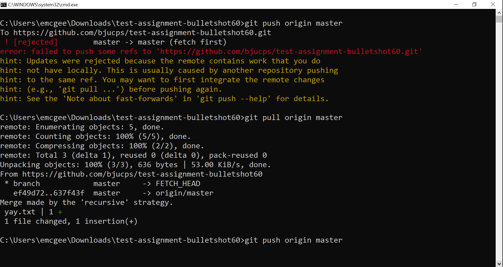
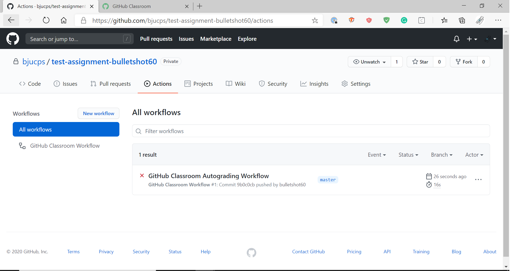
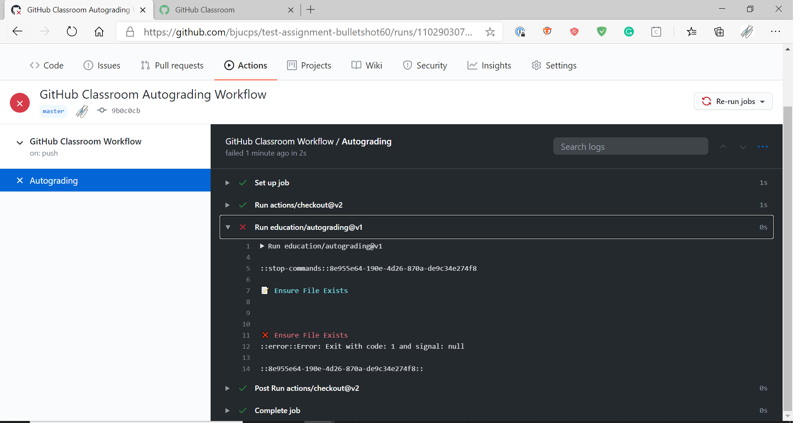

# Instructions for Github Classroom

### Accessing the Assignment

Click the invitation URL provided to you by your professor.  A sample assignment for you to follow along with is provided [here](https://classroom.github.com/a/BCvKee2u).

If you get an error message, wait a few seconds, then click `Retry Repository Setup`.  If it still fails, contact emcgee@bju.edu.  If everything works, click the URL for your new repository.

### Cloning an Assignment Repository

To retrieve the clone URL, click the green `Code` button in the corner. 

If your menu says `Clone with SSH`, click the blue `Use HTTPS` link to change it.  Cloning Github repositories over SSH does not work on campus.

Copy the provided url and in command prompt (or terminal), use the command `git clone <url>`.

You can now make changes in the folder that has been copied to your local machine.

### Updating an Assignment Repository

After making changes, use the `git status` command to see a list of changes.

To stage files for commiting, use `git add <filename>`.  To remove files, use `git rm <filename>`.

Once you have the files you want to save staged, use `git commit -m "<description of what you did>"` to create a commit.

Then send that commit to Github with `git push origin main`.

You can check in the online repository browser to make sure the file made it to the server correctly.

To update an assignment, you'll simply repeat this process with the new or changed files.  Note that if you receive an error message about the remote having changes that you do not, you will need to `git pull origin main` before you can push.

### Testing an Assignment

If this is your first time using our testing software, you'll need to authorize the [Communicator application](https://protect.bju.edu/cps/checker/test/test) to access your Github profile (the only information accessed is your Github username).

After you have connected your Github account to your BJU account, click the Actions tab at the top of your repository.  If you have not yet finished the assignment, the top entry will have a red x.  

Click the name of the result (beside the red x), and then click Autograding.  This will display the details of the failure.  Check to make sure your file names are exactly what was specified.

Once you fix the issue, you should get a green check.

