# Instructions for Github Classroom

> Note: The images here were produced on an OS X machine, but the same instructions (unless otherwise noted) also apply to Windows / Linux machines.

### Setting up for Command Line Submission

To start, ensure that you have installed the Git Command Line Tools for your operating system, see [here](README.md) if you have not yet done so.

On Windows, open command prompt (for Linux / OS X, open terminal), and enter the command `ssh-keygen -t rsa`, pressing enter.  Accept the defaults.

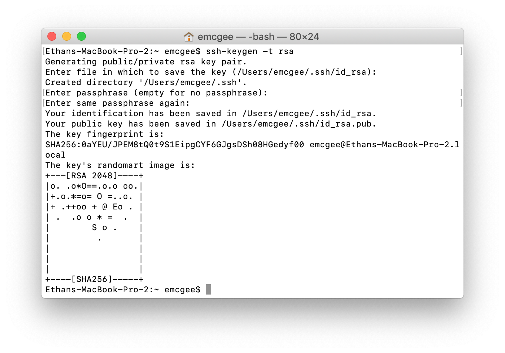

After the command completes, in command prompt enter the command `notepad %USERPROFILE%\.ssh\id_rsa.pub`.  If on OS X / Linux, enter the command `cat ~/.ssh/id_rsa.pub`. Copy the long string of text that appears, then go to [Github](https://github.com).  If you do not already have an account, create one.  Once you're logged in, go to Settings.

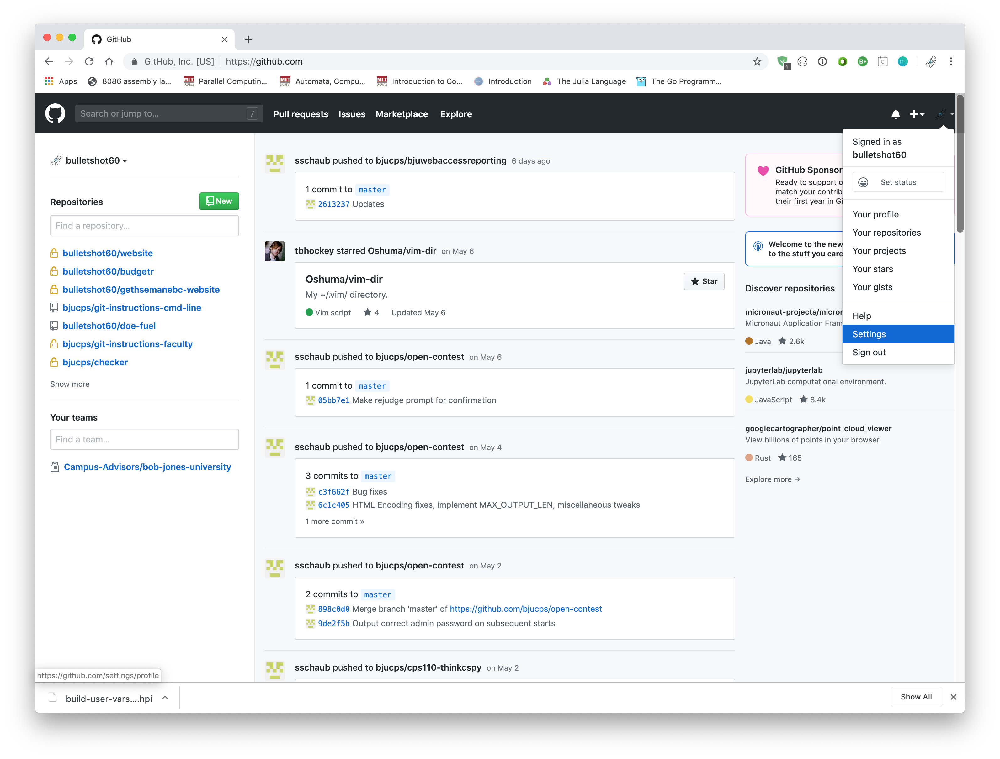

Click on `SSH and GPG Keys` in the side menu, and add a New SSH Key.  Enter something memorable for the name and paste the long string you copied earlier into the second box, then save.

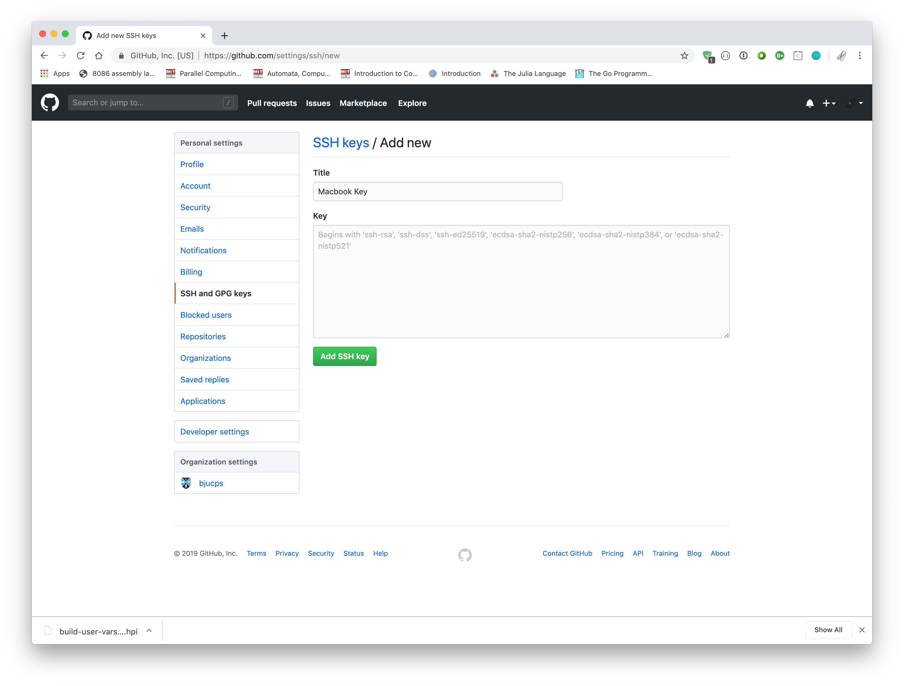

Now configure Git by running the following commands in Command Prompt / Terminal,

    git config --global user.name "<bju username>"
    git config --global user.email "<bju email>"

replacing `<bju username>` with your BJU username and `<bju email>` with your BJU email.

### Accessing the Assignment

Once your profile has been configured, click the invitation URL provided to you by your professor.  A sample assignment for you to follow along with is provided [here](https://classroom.github.com/a/iidjEaf-).

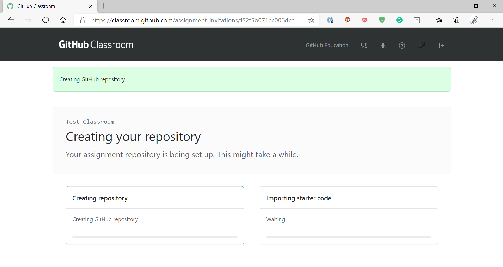

If you get an error message, wait a few seconds, then click `Retry Repository Setup`.  If it still fails, contact emcgee@bju.edu.  If everything works, click the URL for your new repository.

### Cloning an Assignment Repository

To retrieve the clone URL, click the green `Clone or Download` button in the corner. 

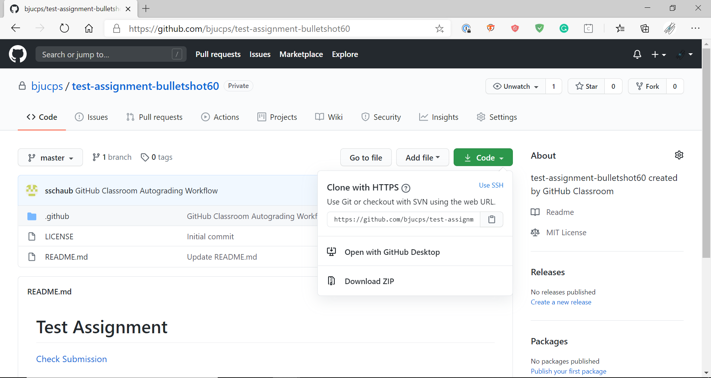

If your menu says `Clone with SSH`, click the blue `Clone with HTTPS` link to change it.  Cloning Github repositories over SSH does not work on campus.

Copy the provided url and in command prompt (or terminal), use the command `git clone <url>`.

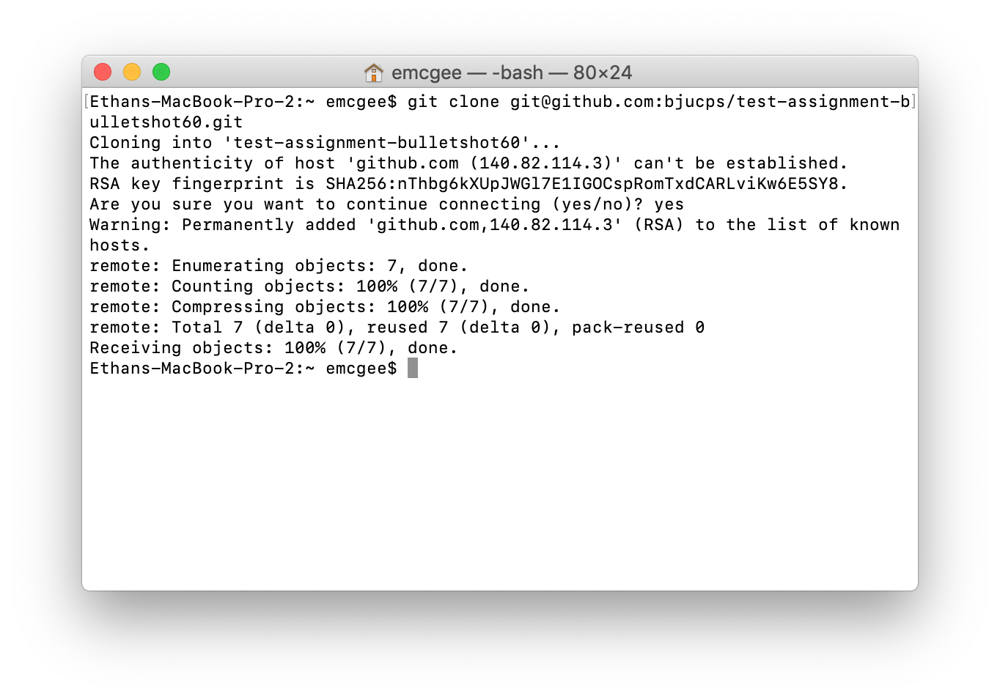

You can now make changes in the folder that has been copied to your local machine.

### Updating an Assignment Repository

After making changes, use the `git status` command to see a list of changes.

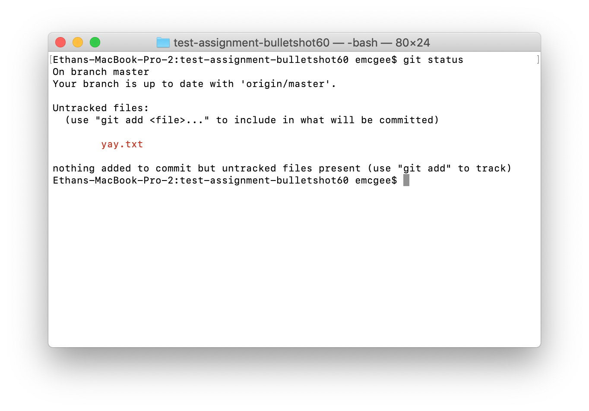

To stage files for commiting, use `git add <filename>`.  To remove files, use `git rm <filename>`.

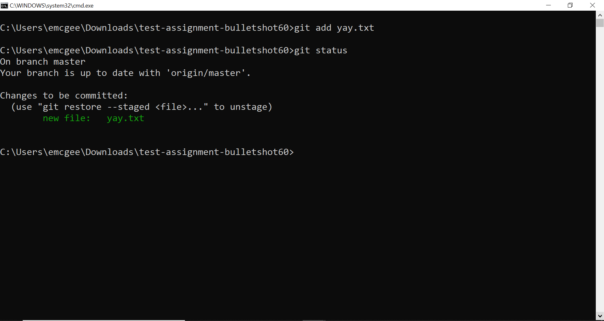

Once you have the files you want to save staged, use `git commit -m "<description of what you did>"` to create a commit.

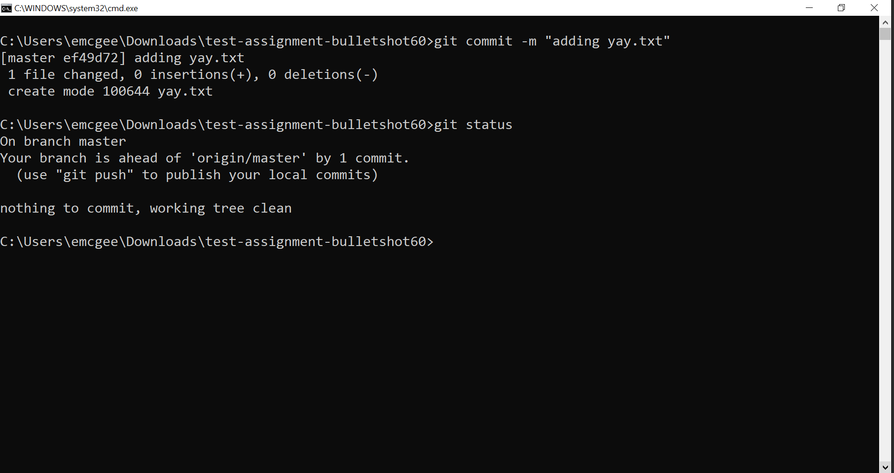

Then send that commit to Github with `git push origin master`.

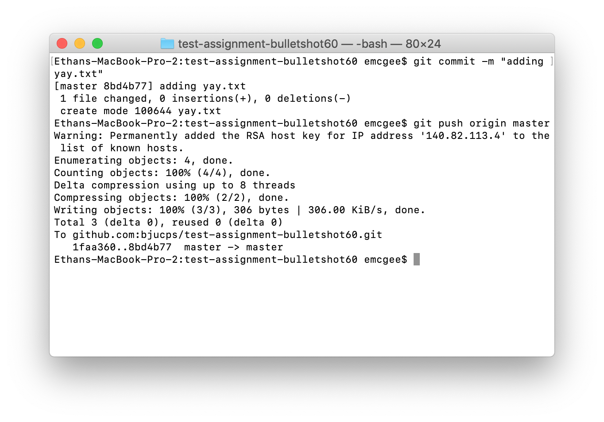

You can check in the online repository browser to make sure the file made it to the server correctly.

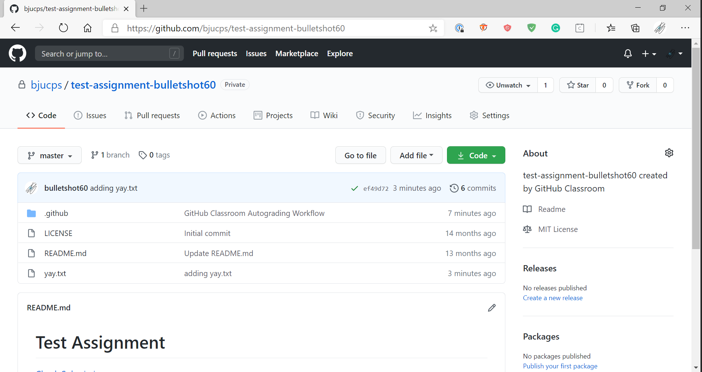

### Testing an Assignment

To test an assignment, click the `Check Submission` link at the top of the README in your repository.

If this is your first time using our testing software, you'll need to authorize the Communicator application to access your Github profile (the only information accessed is your Github username).

After this, you will need to sign into [Jenkins](https://protect.bju.edu/cps/jenkins) with your BJU username / password.

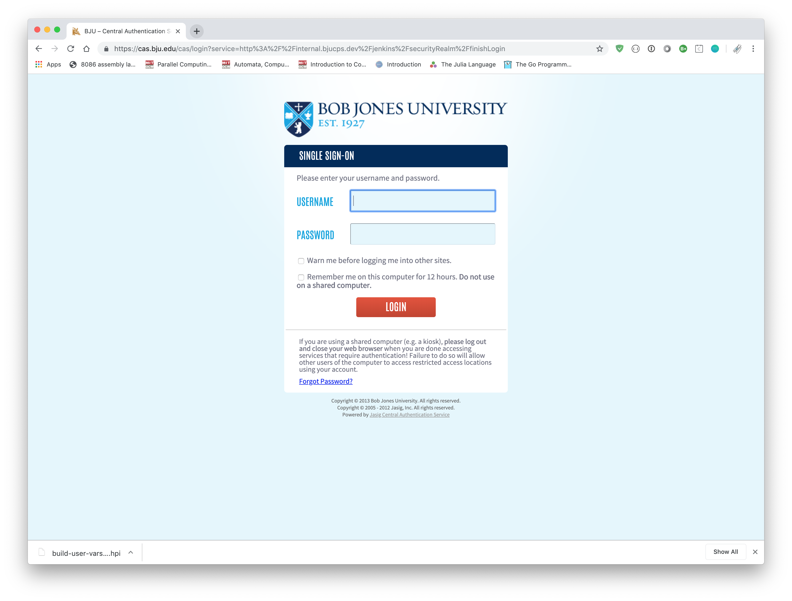

WARNING! Make sure that you enter your username in lowercase.  Using capital letters will cause the testing system to not recognize your login attempt and you will be denied access.

Once you're at the test page, simply click `Build Now` along the right hand side.

In the build results, if you get a blue dot, you've passed all the provided tests.  Note that you are still advised to create your own tests as the instructor tests are much more thorough than the Jenkins tests.

