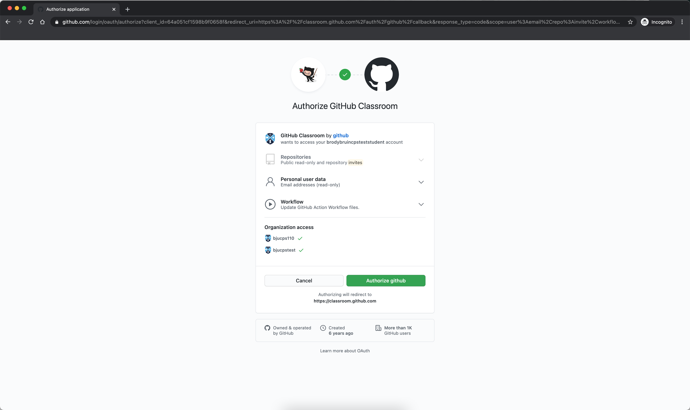
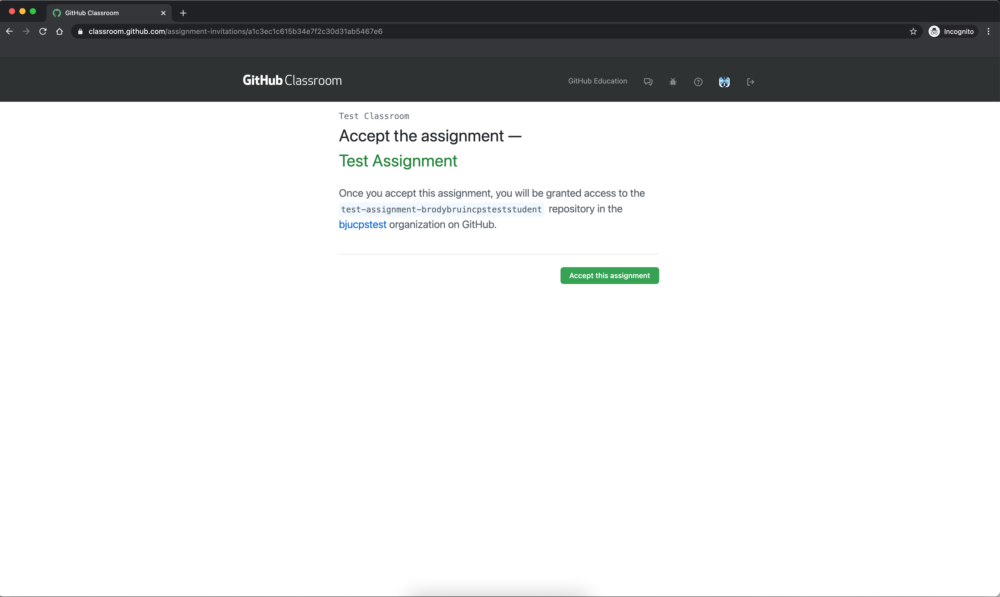
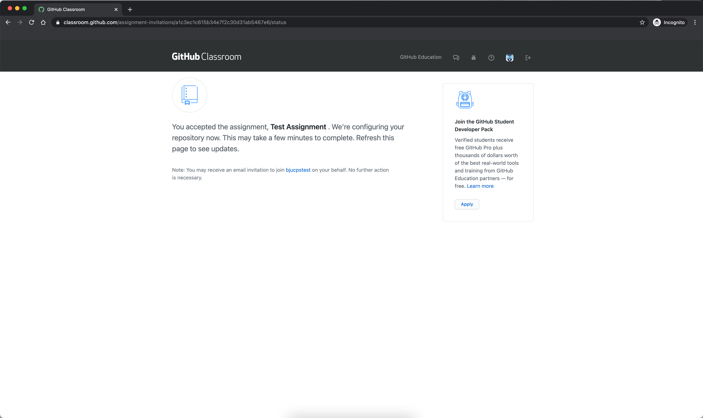
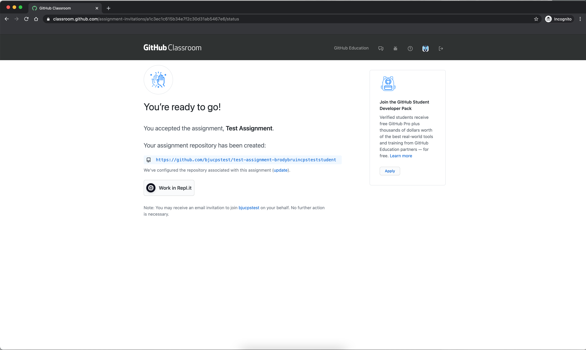
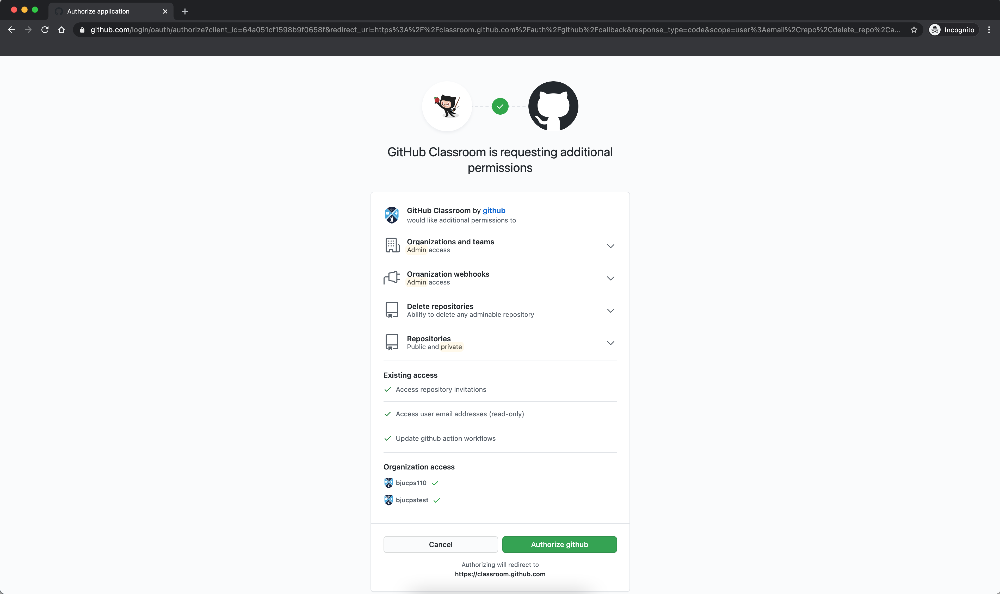
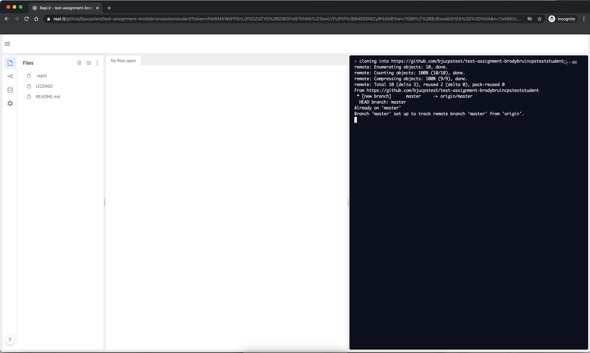

# Instructions for Github Classroom

### Accessing the Assignment

Click the invitation URL provided to you by your professor.  A sample assignment for you to follow along with is provided [here](https://classroom.github.com/a/BCvKee2u).

First, authorize Github classroom to access your account.

The accept the assignment.

You'll need to wait a few moments, then refresh the page.

If everything works, you can either click Work in Repl.it to work in an online IDE or click the URL to access your new repository.

### Updating an Assignment Repository (via Repl.it)

Click Work in Repl.it (either at the top of your README or on the accept accepted screen).  You'll need to give Github a few more permissions for this to work.

Click the Work in Repl.it button again, and you should be good to go. After cloning, the environment is ready to use.

Click the README.md file to read the instructions.

We need to add a file named yay.txt.  Click the Add File button to do that.  Now we need to submit that to Github for grading.  Click the weird fork symbol on the left.

Now type a message then press Commit & Push.  Click the link to your repository at the top of this pane, then  jump on down to Testing an Assignment.

### Updating an Assignment Repository (via Github)

Inside the repository, there are one main button you'll use: `Add File`.  Under this button, you'll find an option for creating a new file as well as uploading files.

Once you've finished making changes, make sure to scroll down and click Commit.

> Note: Once a file is uploaded / created, you can edit / rename / delete the file by clicking the file, and then clicking the pencil icon at the top of the page.

### Testing an Assignment

If this is your first time using our testing software, you'll need to authorize the [Communicator application](https://protect.bju.edu/cps/checker/test/test) to access your Github profile (the only information accessed is your Github username).

After you have connected your Github account to your BJU account, click the Actions tab at the top of your repository.  If you have not yet finished the assignment, the top entry will have a red x.  

Click the name of the result (beside the red x), and then click Autograding.  This will display the details of the failure.  Check to make sure your file names are exactly what was specified.

Once you fix the issue, you should get a green check.

