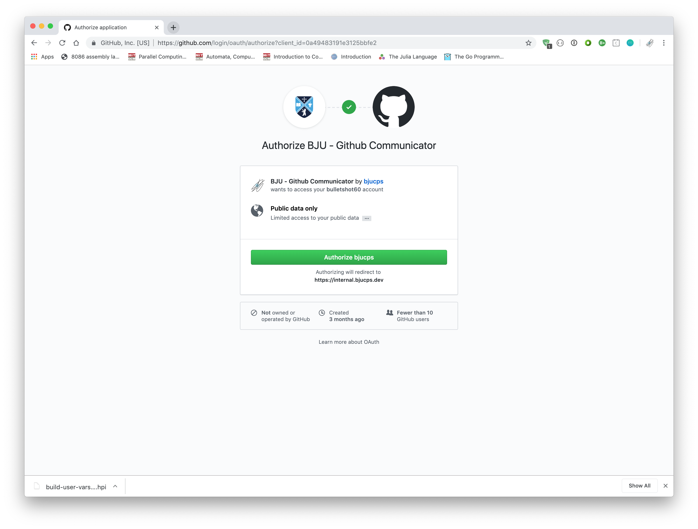

# Instructions for Github Classroom

> Note: The images here were produced on an OS X machine, but the same instructions (unless otherwise noted) also apply to Windows / Linux machines.

### Accessing the Assignment

Click the invitation URL provided to you by your professor.  A sample assignment for you to follow along with is provided [here](https://classroom.github.com/a/iidjEaf-).

If you get an error message, wait a few seconds, then click `Retry Repository Setup`.  If it still fails, contact emcgee@bju.edu.  If everything works, click the URL for your new repository.

### Updating an Assignment Repository

Inside the repository, there are two main buttons you'll use: `Create New File` and `Upload Files`.  Create New File allows you to create and edit a file directly in Github.  Upload allows you to upload files from your desktop.

> Note: Once a file is uploaded / created, you can edit / rename / delete the file by clicking the file, and then clicking the pencil icon at the top of the page.

### Testing an Assignment

To test an assignment, click the `Check Submission` link at the top of the README in your repository.

If this is your first time using our testing software, you'll need to authorize the Communicator application to access your Github profile (the only information accessed is your Github username).

After this, you will need to sign into Jenkins with your BJU username / password.

WARNING! Make sure that you enter your username in lowercase.  Using capital letters will cause the testing system to not recognize your login attempt and you will be denied access.

Once you're at the test page, simply click `Build Now` along the right hand side.

In the build results, if you get a blue dot, you've passed all the provided tests.  Note that you are still advised to create your own tests as the instructor tests are much more thorough than the Jenkins tests.

